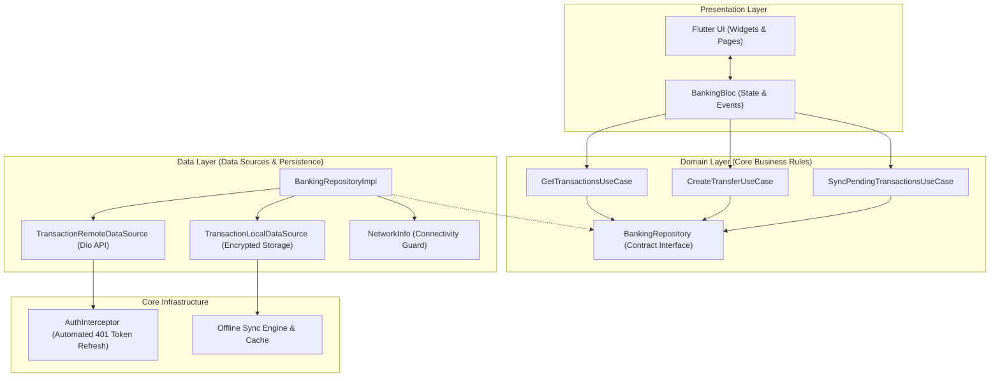

# 🏦 Flutter Enterprise Clean Architecture (Banking & FinTech Core)

[](https://github.com/ameerhassan/flutter-enterprise-clean-architecture/actions)
[](https://flutter.dev)
[](https://dart.dev)
[-047857)](https://blog.cleancoder.com/uncle-bob/2012/08/13/the-clean-architecture.html)
[](https://bloclibrary.dev)
[](LICENSE)

A production-grade, offline-first mobile banking reference application architected for high resilience, banking-grade security, and 60 FPS user experience. Built using **Flutter SDK**, **BLoC (Business Logic Component)**, **Dio Queued Interceptors**, and **Clean Architecture**.

Designed by **Ameer Hassan** (Senior Software Engineer • 9+ Years Experience).

---

## 🏗️ Architectural Topology

This system strictly enforces separation of concerns through Uncle Bob's **Clean Architecture**, guaranteeing that business logic is completely decoupled from UI widgets and third-party frameworks:



---

## ✨ Key Enterprise Engineering Highlights

### 1. Offline-First Optimistic Synchronization
* When the device is offline, fund transfers and transaction logs are immediately committed to local encrypted persistence with a `pendingSync` flag.
* The balance is optimistically updated on the UI so the user experiences zero lag or disrupted workflow.
* As soon as connectivity restores, the **SyncPendingTransactionsUseCase** pushes queued transactions with exponential backoff and idempotency keys to avoid duplicate charges.

### 2. Thread-Safe 401 Token Refresh Interceptor (`AuthInterceptor`)
* Extends Dio's `QueuedInterceptor`.
* When an access token expires in flight, all outgoing network requests are locked in a thread-safe FIFO queue.
* The interceptor requests a fresh OAuth2 Bearer token, persists it into `TokenStorage`, and re-dispatches the queued requests automatically without the user ever seeing a session error.

### 3. Functional Error Handling with Sealed Result Monads
* Zero unchecked runtime exceptions.
* All data flows return `Result<T>` (`Success<T>` or `Error<Failure>`), forcing callers to handle server failures, cache misses, and network dropouts gracefully via `.fold()`.

### 4. Comprehensive Unit & BLoC Test Coverage
* Automated tests built using `mocktail` and `bloc_test`.
* Verifies state transitions, use cases, token interceptor header attachments, and optimistic balance calculations.

---

## 📂 Project Directory Structure

```text
lib/
├── core/                               # Cross-cutting enterprise building blocks
│   ├── error/                          # Typed Failure & Exception hierarchies
│   ├── network/                        # Dio Client, AuthInterceptor, NetworkInfo
│   ├── theme/                          # Material 3 executive typography & design tokens
│   └── utils/                          # Functional Result<T> sealed monad
├── features/
│   └── banking/                        # Domain-driven feature vertical
│       ├── domain/                     # Pure business logic (Zero Flutter dependencies)
│       │   ├── entities/               # TransactionEntity, AccountBalanceEntity
│       │   ├── repositories/           # BankingRepository contract
│       │   └── usecases/               # Isolated single-responsibility use cases
│       ├── data/                       # Data integration layer
│       │   ├── datasources/            # Remote (API) & Local (Cache/Queue)
│       │   ├── models/                 # JSON DTOs with Entity mappers
│       │   └── repositories/           # BankingRepositoryImpl with offline caching
│       └── presentation/               # Reactive user interface
│           ├── bloc/                   # BankingBloc, BankingEvent, BankingState
│           ├── pages/                  # DashboardPage, TransferFundsPage
│           └── widgets/                # BalanceCard, TransactionCard, OfflineSyncBanner
├── injection_container.dart            # GetIt dependency injection registry
└── main.dart                           # Enterprise application entrypoint
```

---

## 🚀 Getting Started

### Prerequisites
* Flutter SDK: `>= 3.13.0`
* Dart SDK: `>= 3.1.0`

### 1. Clone the repository
```bash
git clone https://github.com/ameerhassan/flutter-enterprise-clean-architecture.git
cd flutter-enterprise-clean-architecture
```

### 2. Install dependencies
```bash
flutter pub get
```

### 3. Run Static Code Analysis
```bash
flutter analyze
```

### 4. Run Automated Unit & BLoC Tests
```bash
flutter test
```

### 5. Launch the Application
```bash
flutter run
```

---

## 👨‍💻 Author & Architecture Contact

**Ameer Hassan**  
*Senior Software Engineer (Flutter · Kotlin · Mobile Architecture)*  
* 💼 **LinkedIn:** [linkedin.com/in/ameeerhassan](https://linkedin.com/in/ameeerhassan)  
* 💬 **WhatsApp Direct:** [+92 323 4800044](https://wa.link/a1f8au)  
* 📧 **Email:** [ameerhassan1992@gmail.com](mailto:ameerhassan1992@gmail.com)  
* 🏆 **Meta Certified Android Developer:** [Verify Coursera Credential](https://coursera.org/verify/V82XXF648NBV)
